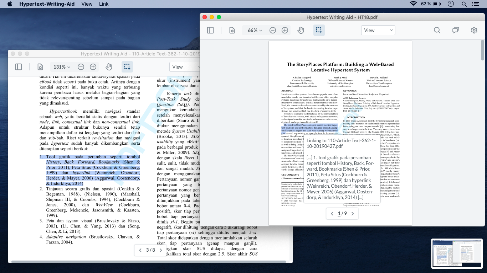

# Hypertext-Writing-Aid
> This program was developed as a prototype for a master thesis that explored bidirectional span-level linking as a scientific writing aid.

Hypertext-Writing-Aid's (HWA) main focus is the ability to link text of PDFs to each other and a simple included text editor. With this the user can not just highlight or annotate PDF documents, but can make connections between them. 



## Installation

Installer's for various operating systems have to be build by the user.

## Development setup

At first the packages have to be downloaded. Then ´run dist´ will build the package for the OS that the command is executed in.

```sh
npm install
npm run dist
```

## Meta

Kevin Taylor – taylork@mail.uni-paderborn.de

[https://github.com/kiwijames/hypertext-writing-aid](github.com/hypertext-writing-aid/)

This applications uses the PDFTron WebViewer and its API. Please check [https://www.pdftron.com/licensing](PDFTron) for license related things.
The icon is based on the Google Docs Flaticon from [https://www.flaticon.com/free-icon/google-docs_2991108?term=document&page=1&position=19 ](flaticon.com).
